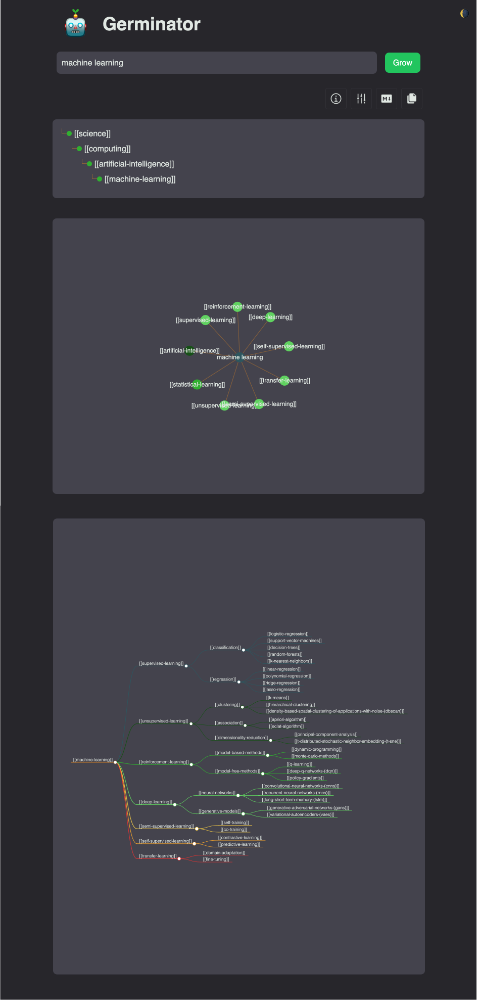

# the germinator

  

> Come with me if you want to [grow](https://germ-inator.netlify.app/).

🌱
🤖 Germinate semantic seedlings for your [🎋 WikiBonsai](https://github.com/wikibonsai/wikibonsai) digital garden.

  

